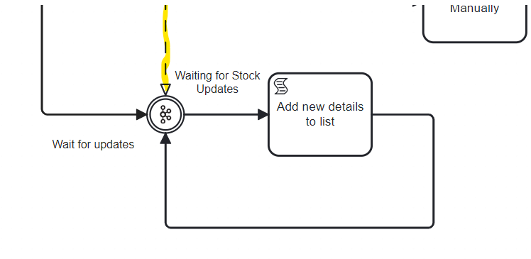
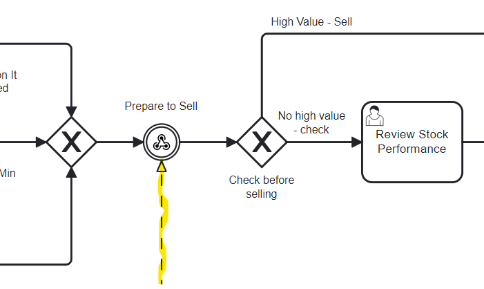

# Camunda Endpoint Diversity Example


This example integrates a variety of systems simulating some of the complexity of building true end-to-end orchestrations. This integration includes REST services, Kafka Events and Front end Applications. Each of these are distributed across different servers. 
    

### Credentials and Account Creation

You’ll need a Kafka instance running. (the easiest place to do that is [confluent.cloud](https://confluent.cloud/)). You’ll need a Camunda 8 Cluster (the easiest place to do that is [Camunda SaaS](https://signup.camunda.com/accounts)). Then the fun can start.
 
Connecting the two systems requires authentication and from your Kafka instance you’ll need the following.

* **Username** -  You’ll get this from creating an API Key for your Kafka instance
* **Password** - Same as the username, it’s part of the API Key creation
* **Bootstrap** **Server** - After you create a Kafka cluster you’ll find this in the cluster settings.

🔐 It’s important to know that it’s best practice not to simply copy and paste this sensitive information directly into the model but rather to [create a secret](https://docs.camunda.io/docs/components/console/manage-clusters/manage-secrets/) for each of these in your Camunda cluster. Then you can reference it by typing `{{secrete.yourSecreteHere}}` followed by the name of the key you want to access. 

For this example to work you'll need to create secretes with the following names:
* KafkaUsername
* KafkaPassword
* KafkaBootstrapServer

Now you’re ready to upload and deploy the process.

### Deploy and Start

Once you have both accounts, it's pretty easy to get started.

#### Camunda Setup
Upload the bpmn model and the forms from their respective folders and add them to your Camunda 8 account. From the modeler you can deploy the process to a cluster. 

#### Kafka Setup
You'll need to create 2 topics Kafka.
`NewDetails` and `Portfolio` 

To start an instance you can create a message on your Kafka cluster to a topic called `NewDetails`
The message payload should look like this:

``` JSON
{
"name" : "NiallCorp",
  "details" : { 
    "update": "Hawk Oriented Coffee Company", 
    "status":  "Great",
    "value" : 80},
  "newStock" : true
}
```
The message should then be picked up by the start event and a process instance should start.


### Triggering the Events

#### Intermediate Kafka Message


In this part of the process a token is waiting for a Kafka message. The message will contain updates about a specific stock item. Once a new message comes in, the result in parsed and added to the existing data structure for the stock item.

To trigger this event create a message on the `NewDetails` topic with the following payload 

``` JSON
{
"name" : "NiallCorp",
  "details" : { 
    "update": "The Company has branched out to include owls", 
    "status":  "Really Great",
    "value" : 180},
  "newStock" : false
}
```
The `name` variable is the correlation key. Process instances will only be triggered if it has a matching variable with the same name. 

The content of the `details` object is added to an existing list in the script task. 

```
append(details, newDetails)
```
#### Intermediate Webhook


After being deployed a URL will be generated and appear in the webhook tab in the modeler's properties panel. You can then use postman to trigger the event. You'll need to include the following payload
```JSON
{
    "name" : "Camunda",
    "highValueSale" : false
}
```

the `highValueSale` variable will determine if the front end application is activated or not as it's evaluated in the gateway following the event